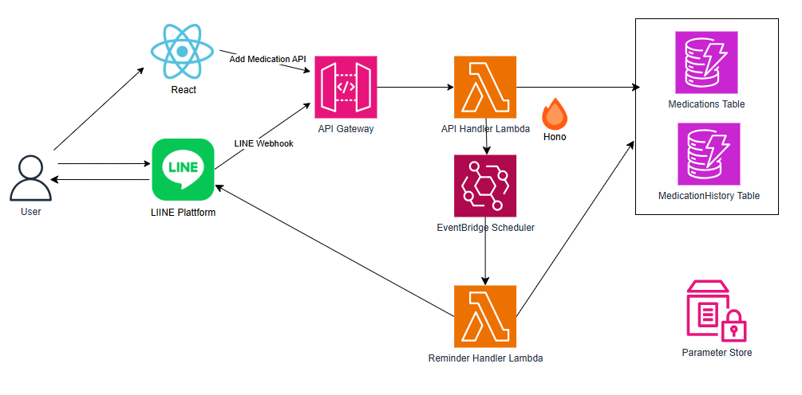

# 薬管理アプリ

このアプリは、AWS CDK と TypeScript を使って構築されたサーバーレスな薬管理システムです。  
ユーザーは薬を登録し、服用履歴を記録、そして自動リマインダー通知で薬の管理が簡単に行えます。

## 概要

**薬管理アプリ** は、薬の登録や服用履歴の記録、そしてリマインダー通知機能を提供するシンプルなアプリです。  

## 主な機能

- **薬の登録・削除**  
  薬の名前、服用スケジュール、服用間隔などを簡単に登録・削除できます。

- **服用履歴の記録**  
  薬を飲んだ時間が自動で記録され、過去の履歴を確認できます。

- **自動リマインダー**  
  決められた時間や間隔に合わせて、薬を飲むリマインダーを自動送信します。

## システム構成

- **AWS Lambda**  
  薬の管理やリマインダー通知を担当するサーバーレス関数。

- **API Gateway**  
  外部からのリクエストを受け付け、Lambda に連携します。

- **DynamoDB**  
  薬情報や服用履歴を保存する NoSQL データベース。

- **EventBridge Scheduler**  
  定期的なリマインダー通知のスケジューリングを実施します。

## コマンド

- `npm run build` compile typescript to js
- `npm run watch` watch for changes and compile
- `npm run test` perform the jest unit tests
- `npx cdk deploy` deploy this stack to your default AWS account/region
- `npx cdk diff` compare deployed stack with current state
- `npx cdk synth` emits the synthesized CloudFormation template
- `cdk synth --no-staging > template.yml` local build
- `sam local start-api` local server run
